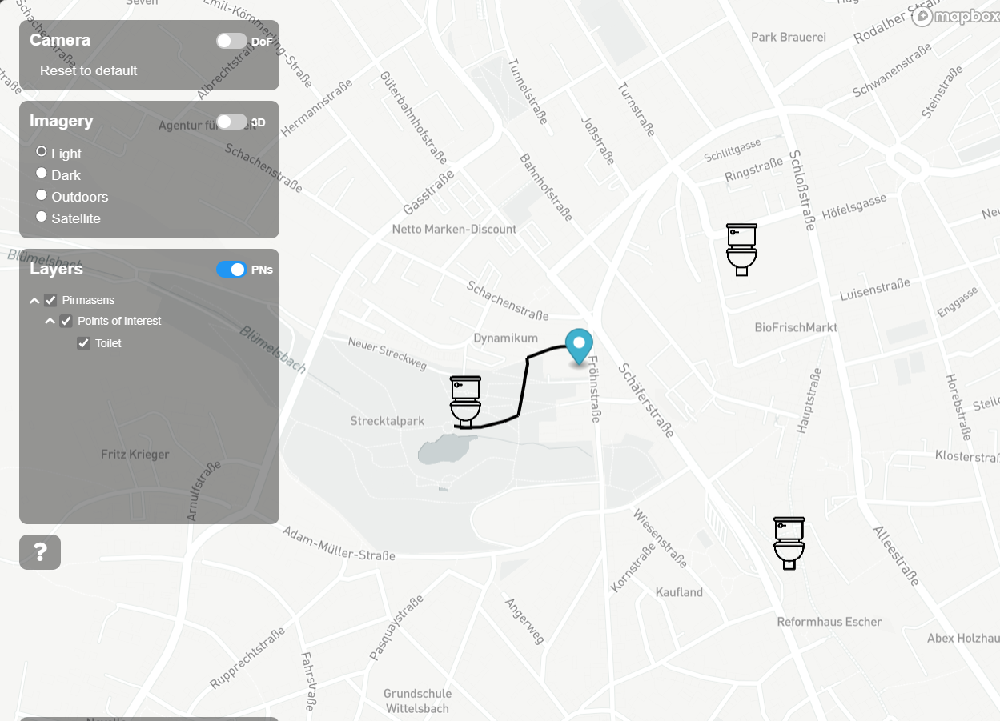

# Pirmasens Flood Routing Digital Twin Visualisation Framework (DTVF)

This visualization serves as a proof of concept for visualization of buildings, routing use cases in Pirmasens

The instantiated data is visualised using the Digital Twin Visualisation Framework ([DTVF]) version `3.3.4`. The configuration file structure (i.e. `data.json`) is based on the [example Mapbox visualisation].



## Prerequisite
A valid Mapbox API token must be provided in your `index.html` file.

## Setting up
## Upload via stack-data-uploader
The data structure and config file to upload the raw OSM data in stack-data-uploader is located in [stack-data-uploader-inputs](stack-data-uploader-inputs/) directory. 

### OSM Routing Data (Routable data)
1) Download desired bounding box from [BBBike.org](https://extract.bbbike.org/) (check junk email) or [GeoFabrik](https://download.geofabrik.de/) in `.pbf` format.
2) `.pbf` uploaded via stack-data-uploader in [osm2pgrouting](https://github.com/cambridge-cares/TheWorldAvatar/tree/main/Deploy/stacks/dynamic/stack-data-uploader#osm-data) data type.
3) Place the file [here](stack-data-uploader-inputs/data/pirmasens_toilets/routing/).

### OSM Raw Data (Points and Polygons)
To prepare OSM data in `.gml` format
1) Download desired bounding box from [BBBike.org](https://extract.bbbike.org/) (check junk email) or [GeoFabrik](https://download.geofabrik.de/) in `.pbf` format.
2) Convert the `.pbf` file into `.osm` format using [osmconvert](https://wiki.openstreetmap.org/wiki/Osmconvert). 
3) Import the `.osm` file  into QGIS using [QuickOSM](https://plugins.qgis.org/plugins/QuickOSM/) plugin, then export points and polygons layer as `points.gml` and `polygons.gml`.
4) Place the file in [points directory](stack-data-uploader-inputs/data/pirmasens_toilets/point/) and [polygons directory](stack-data-uploader-inputs/data/pirmasens_toilets/polygon/).

### Run IsochroneAgent
1) Run IsochroneAgent with the inputs as specified in [IsochroneAgent/Inputs](IsochroneAgent/inputs/).
2) Change the Ontop endpoint with your stack-name in the service clause.
3) The isochroen generated are in the intervals of 1 minutes. 

## Starting the visualisation
```
# To build the Image:
docker-compose -f ./docker/docker-compose.yml build --force-rm

# To generate a Container (i.e. run the Image):
docker-compose -f ./docker/docker-compose.yml up -d --force-recreate
```

<!-- Links -->
[DTVF]: https://github.com/cambridge-cares/TheWorldAvatar/wiki/Digital-Twin-Visualisations
[example Mapbox visualisation]: https://github.com/cambridge-cares/TheWorldAvatar/tree/main/web/digital-twin-vis-framework/example-mapbox-vis
[FeatureInfoAgent]: https://github.com/cambridge-cares/TheWorldAvatar/tree/main/Agents/FeatureInfoAgent

<!-- repositories -->
[FeatureInfoAgent subdirectory]: /DTVF/FeatureInfoAgent
[FeatureInfoAgent queries]: FeatureInfoAgent/queries
[DTVF subdirectory]: /DTVF
[icons]: /DTVF/data/icons
[index.html]: index.html
[data.json]: /DTVF/data.json